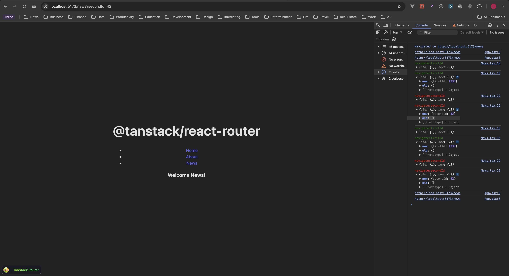

# `@tanstack/react-router` navigate in useEffect bug

## Reproduction #1

1. Install dependencies via `pnpm i`
2. Start the dev server via `pnpm dev`
3. Open the console.
4. Navigate to `/news`
5. Only `?secondId=42` is applied. Also see how `old` is empty for the `navigate:secondId`.

### Expected
Both params are applied, thus `?firstId=1337&secondId=42`.

### Actual
Only `?secondId=42` is applied.



## Reproduction #2

1. Install dependencies via `pnpm i`
2. Start the dev server via `pnpm dev`
3. Open the console.
4. Navigate to from `/` to `/repro3` via the "Repro #3"
5. The console logs the default params `{ "param1": 7, "param2": "defaultValue1" }`
6. The params are not attached to the URL (expected: they are attached to the URL)
7. Do a reload via CMD + R
8. Now, search params are attached to the URL

## Reproduction #3
**IMPORTANT**: This bug was fixed with the release of [v1.45.5](https://github.com/TanStack/router/releases/tag/v1.45.5)

1. Install dependencies via `pnpm i`
2. Start the dev server via `pnpm dev`
3. Navigate to `/about` via the "About" link
4. Have a look at the console which logs the `location.href`

```sh
http://localhost:5173/
App.tsx:5 http://localhost:5173/
App.tsx:5 http://localhost:5173/about
App.tsx:5 http://localhost:5173/about
About.tsx:9 useEffect
About.tsx:9 useEffect
App.tsx:5 http://localhost:5173/about
App.tsx:5 http://localhost:5173/about
App.tsx:5 http://localhost:5173/?id=a1337b00c99
App.tsx:5 http://localhost:5173/?id=a1337b00c99
```

## Actual
The app correctly navigates to `/about`, then the `useEffect` ([`About.tsx:8-16`](https://github.com/lukaskoeller/tanstack-react-router-useEffect-navigate-reproduction/blob/0871b04aa1222660fc5065bcb73fca6beaaba497/src/About.tsx#L8)) correctly runs.
After that it navigates back to `/` with the `id` query param attached

## Expected
Instead I would expect the `id` query param to be attached to the `/about` page. Thus,
the latest log should be `http://localhost:5173/about?id=a1337b00c99` instead.